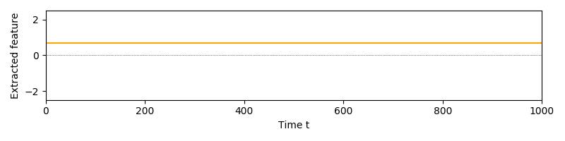
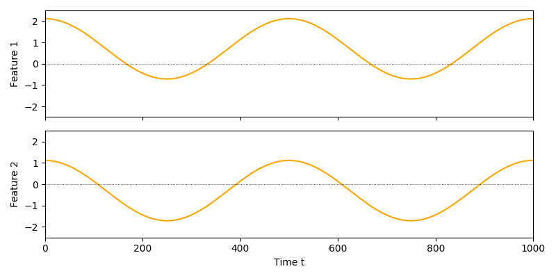
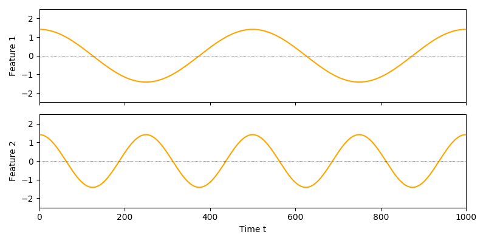

.. title:: User guide : contents

.. _user_guide:

.. _SFA:

==================================================
User guide: Slow Feature Analysis
==================================================

Slowness as extraction principle
--------------------------------

The heart of this package is an implementation of Slow Feature Analysis [1]_. SFA is
a method for dimensionality reduction that takes into account the temporal
structure of time-series data. Specifically, it tries to identify and extract 
slowly changing features. At the method's core lies the following hypothesis:

.. admonition:: Slowness hypothesis:

        In natural data, observable features vary quicker than the underlying latent factors. 
        Thus, slowness is a good proxy to extract useful information.
       

Interestingly, SFA has a strong connection to spectral embedding methods and can be considered an efficient parametric approach to manifold learning [2]_.

Outside machine learning, SFA has been shown to be an effective model for phenomena in the mammalian 
Hippocampal formation, such as place cells, head-direction cells or spatial-view cells [3]_. 

Quick Start: the SFA transformer
--------------------------------

The class :class:`sksfa.SFA` implements the version of SFA described in the next section. 
The number of output components has to be fixed at initialization:

.. code-block:: python

    from sksfa import SFA
    sfa = SFA(n_components=2)

To train it on a time-series dataset, the ``fit`` function is called:

.. code-block:: python

    sfa.fit(data)

The transformer is now trained and can be executed using ``transform``:

.. code-block:: python

    extracted_features = sfa.transform(data)

Alternatively, ``fit_transform`` can be used to do train and apply SFA in the same step:

.. code-block:: python

    new_sfa = SFA(n_components=2)
    extracted_features = sfa.fit_transform(data)

.. admonition:: SFA is memory-less

        It is important to note SFA is **trained** on time-series data to provide the temporal structure necessary to find slowly-varying features. It is, however, a memory-less representation. That means, after training it can be applied to individual data-points.

Slowness as optimization problem
--------------------------------

Given a time-series dataset  :math:`\{\mathbf{x}(t)\}_{1:n_\text{samples}}` with :math:`\mathbf{x}(t) \in \mathbb{R}^{d_\text{input}}`, the SFA objective is defined as follows:

.. math::
   :nowrap:

   \begin{eqnarray*}
      \min_{f\in\mathcal{F}} \mathbb{E}_{t, t+1}\left[\|f(\mathbf{x({t+1})}) - f(\mathbf{x(t)})\|^2\right]
   \end{eqnarray*}

where :math:`\mathcal{F}` is a set of functions :math:`f: \mathbb{R}^{d_\text{input}} \mapsto \mathbb{R}^{d_\text{output}}` and :math:`d_{\text{output}} \leq d_{\text{input}}`.

.. admonition:: Note

        In practice, the empirical counterparts of all statistical quantities are considered. This is omitted in the following discussion.

However, there are multiple caveats when optimizing this objective. To illustrate, let us look at a 1-dim output signal first.

When optimizing the objective without constraints, the perfect but uninformative solution is just a map that maps everything to a constant. 
In SFA this is solved by adding a unit-variance constraint which would be violated by constant outputs.

.. math::
   :nowrap:

   \begin{eqnarray*}
        \text{Var}(f_i(\mathbf{x}_t)) = 1, \quad \forall i
   \end{eqnarray*}

A 2-dim output signal with this constraint added would look like this:

While this looks better, there are two issues:

#. Output signals contain arbitrary constant shifts.
#. The features carry redundant information.
   
The first issue can easily be resolved by adding a zero-mean constraint:

.. math::
   :nowrap:

   \begin{eqnarray*}
        \mathbb{E}[f_i(\mathbf{x}_t)] = 0, \quad \forall i
   \end{eqnarray*}

Since it is hard to enforce true independence, SFA uses a decorrelation constraint to solve the redundancy issue:

.. math::
   :nowrap:

   \begin{eqnarray*}
        \text{Cov}(f_i(\mathbf{x}_t), f_j(\mathbf{x}_t)) = \delta_{ij}, \quad \forall i,j
   \end{eqnarray*}

where :math:`\delta_{ij}` is the Kronecker delta.  Note that this constraint also contains the unit-variance contraint previously discussed.

An output signal extracted with the constraints in place might look like this:

Bringing all this together, the complete optimization problems is formulated as follows:

.. math::
   :nowrap:

   \begin{eqnarray*}
      \min_{f\in\mathcal{F}} & \mathbb{E}_{t, t+1}\left[ \|f(\mathbf{x({t+1})}) - f(\mathbf{x(t)})\|^2 \right] \\
      \text{s.t.} & \mathbb{E}[f_i(\mathbf{x}_t)] &= 0, \quad \forall i \\
                  & \text{Cov}(f_i(\mathbf{x}_t), f_j(\mathbf{x}_t)) &= \delta_{ij}, \quad \forall i,j \\
   \end{eqnarray*}

Additionally, SFA typically produces ordered output features, that means: 

.. math::
   :nowrap:

   \begin{eqnarray*}
        \forall i, j:\quad i<j \Rightarrow \Delta (f_i(\mathbf{x}_t)) < \Delta (f_j(\mathbf{x}_t)) 
   \end{eqnarray*}

Solving linear SFA
------------------

This package implements a way to solve the SFA problem for the case that :math:`\mathcal{F}` is the family of linear/affine functions, where each model can be
parameterized by a matrix :math:`\mathbf{W}` as well a bias vector :math:`\mathbf{b}` as:

.. math::
   :nowrap:

   \begin{eqnarray*}
   f(\mathbf{x}) = \mathbf{W}(\mathbf{x} + \mathbf{b}) 
   \end{eqnarray*}

Since :math:`\mathbf{b}` does not change the objective and is only used to satisfy the zero-mean constraint, it has an easy solution:

.. math::
   :nowrap:

   \begin{eqnarray*}
   \mathbf{b}^* = -\frac{1}{T} \sum_{t=1}^T \mathbf{x}_t
   \end{eqnarray*}

Let :math:`\tilde{\mathbf{x}}` denote data that has been shifted like this to have zero-mean.

The :math:`\tilde{\mathbf{x}}` are then normalized along their principal directions. This procedure called **whitening** forces the output to fulfill the constraints, as whitening ensures that the data has unit-variance in every direction and is decorrelated when projected onto any orthonormal set of vectors.

Whitening can be expressed as a linear map with 

.. math::
   :nowrap:

   \begin{eqnarray*}
        \mathbf{x}^\text{white} = \mathbf{D}^{-\frac{1}{2}}\mathbf{U}^Tx
   \end{eqnarray*}

where the covariance matrix of :math:`\tilde{\mathbf{x}}` is eigen-decomposed as :math:`\mathbf{C}_{\tilde{\mathbf{x}}}=\mathbf{UDU}^T`. It is easy to verify that the data will have identity-covariance afterwards. This package uses the whitening handily implemented in sklearn's PCA class.

For whitened data, the optimization problem reduces to finding a set of orthogonal vectors that minimize the objective. To find these vectors, another PCA is performed on the dataset of finite differences :math:`\dot{\mathbf{x}_t}^\text{white}=\mathbf{x}^\text{white}_{t+1} - \mathbf{x}^\text{white}_{t}`.

The white data is then projected onto the minor components of the finite differences:

.. math::
   :nowrap:

   \begin{eqnarray*}
        \mathbf{y} = \tilde{\mathbf{V}}^T \mathbf{x}^\text{white}
   \end{eqnarray*}

where :math:`\mathbf{V}` is the matrix of eigenvectors of the difference's covariance :math:`\mathbf{C}_{\dot{\mathbf{x}}}=\mathbf{V}\mathbf{\Lambda}\mathbf{V}^T` and :math:`\tilde{\mathbf{V}}` corresponds to the (non-square) matrix of only the :math:`e` eigenvectors of the minor components.

Together, this gives us a closed-form solution for linear functions:

.. math::
   :nowrap:

   \begin{eqnarray*}
        \mathbf{b}^* = -\frac{1}{T} \sum_{t=1}^T \mathbf{x}_t \\
        \mathbf{W}^* = \tilde{\mathbf{V}}\mathbf{D}^{-\frac{1}{2}}\mathbf{U}^T
   \end{eqnarray*}

Learning non-linear maps
------------------------

Even though the vanilla SFA is defined to learn linear mappings, this restriction can easily be alleviated by expansion into a non-linear basis, such as polynomials on the input data. Native non-linear formulations exist, but are out-of-scope for this package.

A very typical basis for expansion are polynomials of some degree. We recommend using scikit-learn's `PolynomialFeatures`:

.. code-block:: python

   from sksfa import SFA
   from sklearn.preprocessing import PolynomialFeatures

   pf = PolynomialFeatures(degree=3)
   expanded_data = pf.fit_transform(data)

   sfa = SFA(n_components=2)
   output_features = sfa.fit_transform(expanded_data)

More compactly, this can be connected in a scikit-learn ``Pipeline``:

.. code-block:: python

   from sklearn.pipeline import Pipeline

   quadratic_sfa = Pipeline([("Expansion", PolynomialFeatures(degree=2)),
                                  ("SFA", SFA(n_components=2)])
   output_features = quadratic_sfa.fit_transform(data)

Note that non-linear expansion is a standard trick in classical approximation and machine learning and not specific to SFA.

Cascading
_________

If expansion to polynomials of higher degree are needed, but the expanded dimensionality would be too high, **cascading** can be used. 
When cascading SFA, lower order polynomial expansions are subsequently applied, but interlaced with dimensionality reduction steps. 
In practice, it is often assumed that highly expressive slow features can be constructed from less expressive slow features. Relying on 
this assumption, intermediate reduction can also be done by SFA:

.. code-block:: python

   nb_steps = 3
   cascade = []
   for step in range(nb_steps):
         cascade.append((f"Expansion{step}", PolynomialFeatures(degree=2)))
         cascade.append((f"SFA{step}", SFA(n_components=2)))
   cascaded_sfa = Pipeline(cascade)
   output_features = cascaded_sfa.fit_transform(data)

In this case, three quadratic expansions are performed, effectively leading to output polynomials of degree 8. Even though they do
not capture all information a direct and full expansion might, cascading is typically preferred to directly expanding with high degrees
for improved generalization and tractability.

Hierarchical Networks (HSFA)
____________________________

If even low degree expansions are infeasible and initial reduction by linear SFA would likely lead to significant loss of relevant information, additional structure has to be assumed for the data. 

Luckily, one of the most common sources of high-dimensional data is image data (e.g., from a video or camera sensors), which naturally provides a lot of additional structure:
For images, we can typically assume that it is sufficient to capture only **local** relationships in early processing. That means, in first dimensionality reduction steps, we do not lose much information if we only capture relationships between nearby pixels and discard relationships between pixels that are far apart. 
It is also reasonble to assume, that this local structure is invariant for all parts of the input image.
A very prominent example of models exploiting exactly these structural properties are convolutional neural networks.

For SFA, this is typically done using a method called *Hierarchical SFA (HSFA)*. The original images are sliced into -- possibly overlapping -- receptive fields, thereby using the assumption that local relationships are sufficient.
The animation below shows four non-overlapping receptive fields on a simple image time-series.

Each receptive field will generate a time-series containing only the covered section. A single non-linear SFA is then trained on all resulting time-series', preceded by a linear SFA step. The animation below shows the input used to train this layer's SFA. The steps between fields are **not** considered connected, but each color indicates an independent time-series.

The output slow features make for a single "pixel" of the layer's output, with the features as channels: Thus, if we would extract 8 features per field, a single output would be of shape (2, 2, 8). This procedure is repeated until a sufficiently low dimensionality has been reached and/or a sufficient amount of non-linearity has been injected into the model. 
Afterwards, the output will be flattened into vectors and a final SFA is used to extract the desired number of output features.

For convenience, HSFA is implemented in this package. It should, however, be considered **experimental** at this point in time.

Inspection and evaluation
-------------------------

To be added.

Time Complexity
---------------

The time complexity of training using the SFA estimator's *fit* function is mainly dominated by the PCA computation [4]_. Since SFA always has to perform PCA for a full-range of output components before selecting the slowest ones (minor components), it cannot utilize the number of output features beforhand, this means:

.. math::
   :nowrap:

   \begin{eqnarray*}
        \mathcal{O}(r^2 \cdot s)
   \end{eqnarray*}

for :math:`r = \max (n_\text{samples}, d_\text{input})` as well as  :math:`s = \min (n_\text{samples}, d_\text{input})`.

Note that it is beneficial if the covariance matrix of the data is non-singular to avoid trivial features. In this case, :math:`n_\text{samples} >= d_\text{input}` is a necessary (but not sufficient) condition. Thus:

.. math::
   :nowrap:

   \begin{eqnarray*}
        \mathcal{O}(n_\text{samples}^2 \cdot d_\text{input})
   \end{eqnarray*}

References
----------
.. admonition:: References:

   .. [1] `"Slow Feature Analysis: Unsupervised Learning of Invariances."
      <https://www.ini.rub.de/PEOPLE/wiskott/Reprints/WiskottSejnowski-2002-NeurComp-LearningInvariances.pdf>`_
      L. Wiskott, T. Sejnowski, 2002

   .. [2] `"On the Relation of Slow Feature Analysis and Laplacian Eigenmaps."
      <https://www.mitpressjournals.org/doi/abs/10.1162/NECO_a_00214?journalCode=neco>`_
      H. Sprekeler, 2011

   .. [3] `"Slowness and Sparseness Lead to Place, Head-Direction, and Spatial-View Cells."
      <https://journals.plos.org/ploscompbiol/article/file?id=10.1371/journal.pcbi.0030166&type=printable>`_
      M. Franzius, H. Sprekeler, L. Wiskott, 2007

   .. [4] `"Scikit-learn User Guide: PCA."
      <https://scikit-learn.org/stable/modules/decomposition.html>'_

